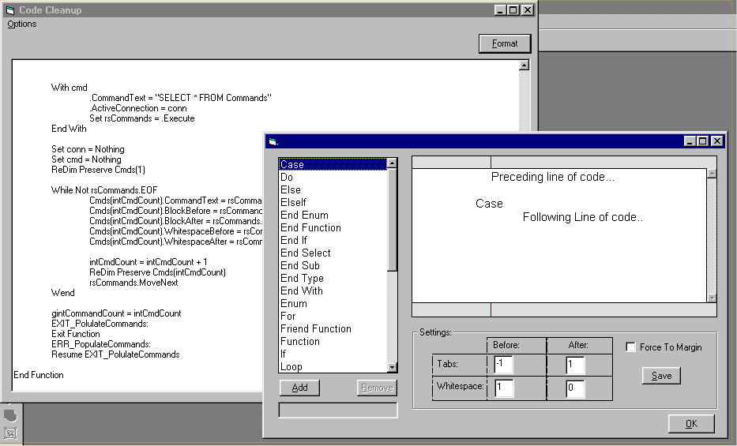



## Format Source Code

### Description

*REPOST* Sorry all...I left out a form file. This one should be good...

Completely formats source code text...(adds white space, blocks). Fully customizable...add new commands, change formatting preferences, etc.

Currently set up for VB, but can easily be customized to any language. This is a port from an add-in I wrote last year. Someone was asking about some code that did this that Ulli took off of PSC when he got mad and left. I never saw his code (probably better than mine) but since I had it, I decided to post it. This works surprisingly well. NOTE: This project is for DEMONSTRATION. It is a quick port from a VB add-in. Therfore, it may have some bugs...but I don't know of any.
 
### More Info
 

             |
---                |---
**Submitted On**   |2001-06-21 10:33:46
**By**             |[Matthew Roberts](https://github.com/Planet-Source-Code/PSCIndex/blob/master/ByAuthor/matthew-roberts.md)
**Level**          |Intermediate
**User Rating**    |4.5 (18 globes from 4 users)
**Compatibility**  |VB 5\.0, VB 6\.0
**Category**       |[VB function enhancement](https://github.com/Planet-Source-Code/PSCIndex/blob/master/ByCategory/vb-function-enhancement__1-25.md)
**World**          |[Visual Basic](https://github.com/Planet-Source-Code/PSCIndex/blob/master/ByWorld/visual-basic.md)
**Archive File**   |[Format Sou214626212001\.zip](https://github.com/Planet-Source-Code/matthew-roberts-format-source-code__1-24286/archive/master.zip)

